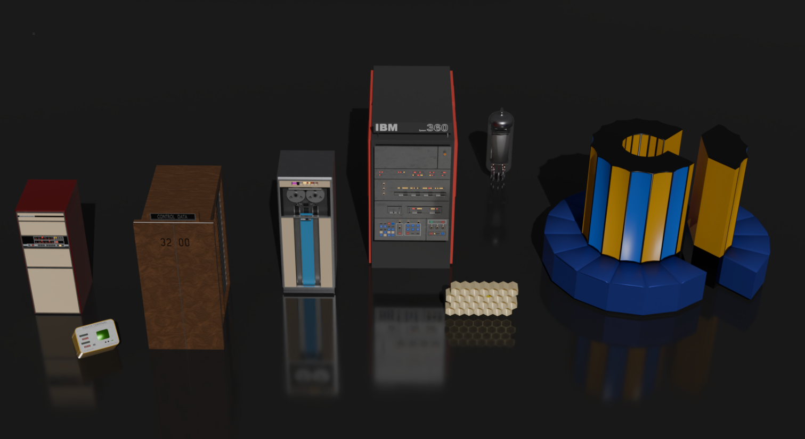

# MediaCERN

#### Drafted work plan to carry on between Jan-Sept 2024 at CERN. Working between the [IT department](https://information-technology.web.cern.ch/) and the [Media Lab](https://gitlab.cern.ch/CERNMediaLab) to build (1) an interactive digital exhibition about the evolution of computing in the Data Centre ([here](https://computing-exhibit.web.cern.ch/index.html) a digital laboratory of the evolving work), and (2) an animation series for the CERN [Quantum Technology Initiative](https://quantum.cern/). 

- JANUARY 
  - join the section and getting to speed
  - Integrate Joao’s teams
  - Integrate Jacques’ team
  - EGL screen: 
      - move the content to inside the exhibition room 
      - create slide show with figures about the IT Department together with Mariana
- FEBRUARY
  - First draft of video script (or series of videos/documentary) about Quantum (Anastasia, Alberto, Michele Grossi, Sofia Vallecorsa, Tim-OQI): interviews, animations, definition of the series (if applicable)
  - Selection of heritage objects (Tim and Miguel)
  - First proposal of narratives for the heritage objects exhibit
- MARCH-MAY
  - Video(s):
    - Consolidation of video(s), 
    - progress on animations, 
    - selection of interviewees, 
    - recording of interviews
  - Exhibit:
    - Definition of the interactive exhibit
    - Procurement of hardware for the exhibit
    - Start working on the software development for the exhibit
    - plan the preparation works for the installation
- JUNE-JULY-AUGUST (INCLUDING HOLIDAYS)
  - Video(s):
    - montage - it can be trailer, educational and series.
    - finalisation of animations
  - Exhibit:
    - consolidation of all the backend of the exhibit
- SEPTEMBER 
  - Videos: finalise everything
  - Exhibit: finalise all works

